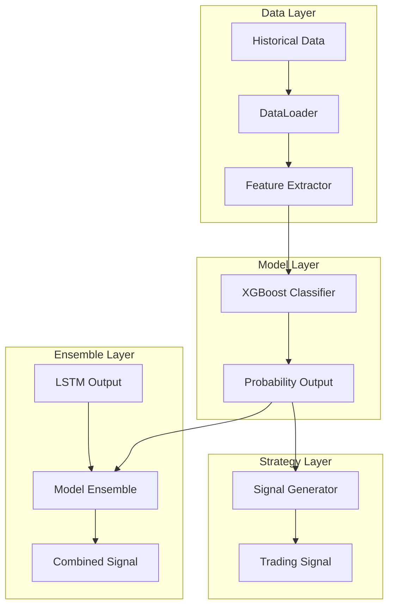

# XGBoost Strategy Design Document

## Overview

本设计文档描述了XGBoost交易策略的技术架构和实现细节。该策略使用XGBoost梯度提升算法预测交易信号，目标是达到IC > 0.05的预测能力，并与现有LSTM策略兼容以支持模型融合。

### 设计目标

1. **高预测能力**: IC (Information Coefficient) > 0.05
2. **LSTM兼容**: 复用特征工程，输出格式一致，支持集成学习
3. **可配置性**: 支持超参数调优和命令行训练
4. **可维护性**: 遵循现有代码结构和设计模式

## Architecture



### 数据流

1. **训练流程**: Historical Data → DataLoader → Feature Extractor → XGBoost Trainer → Model File
2. **推理流程**: K-line Data → Feature Extractor → XGBoost Model → Probability → Signal

## Components and Interfaces

### 1. XGBoostStrategy (strategies/xgboost_strategy.py)

继承自`BaseStrategy`，实现XGBoost交易策略。

```python
class XGBoostStrategy(BaseStrategy):
    """XGBoost交易策略"""
    
    def __init__(self, trader, interval='15m', symbol=None):
        """初始化策略
        
        Args:
            trader: 交易器实例
            interval: K线周期
            symbol: 交易对
        """
        pass
    
    def generate_signal(self, klines=None) -> int:
        """生成交易信号
        
        Args:
            klines: K线数据
            
        Returns:
            信号: 1=买入, -1=卖出, 0=观望
        """
        pass
    
    def get_prediction_proba(self, features: np.ndarray) -> np.ndarray:
        """获取预测概率分布
        
        Args:
            features: 特征矩阵
            
        Returns:
            概率分布 [p_down, p_hold, p_up]
        """
        pass
    
    def monitor_position(self):
        """监控仓位"""
        pass
```

### 2. XGBoostTrainer (strategies/xgboost_trainer.py)

负责模型训练、验证和评估。

```python
class XGBoostTrainer:
    """XGBoost模型训练器"""
    
    def __init__(self, params: dict = None):
        """初始化训练器
        
        Args:
            params: XGBoost超参数
        """
        pass
    
    def train(self, X_train, y_train, X_val, y_val) -> xgb.Booster:
        """训练模型
        
        Args:
            X_train: 训练特征
            y_train: 训练标签
            X_val: 验证特征
            y_val: 验证标签
            
        Returns:
            训练好的模型
        """
        pass
    
    def calculate_ic(self, y_true: np.ndarray, y_pred_proba: np.ndarray) -> float:
        """计算信息系数 (IC)
        
        使用Spearman秩相关系数计算预测概率与实际收益的相关性
        
        Args:
            y_true: 实际标签或收益
            y_pred_proba: 预测概率
            
        Returns:
            IC值
        """
        pass
    
    def evaluate(self, X_test, y_test) -> dict:
        """评估模型
        
        Returns:
            包含accuracy, precision, recall, f1, ic, confusion_matrix的字典
        """
        pass
    
    def save_model(self, path: str):
        """保存模型"""
        pass
    
    def load_model(self, path: str):
        """加载模型"""
        pass
```

### 3. XGBoostFeatureExtractor

复用现有的`LSTMFeatureExtractor`，但XGBoost不需要序列输入，因此需要适配器。

```python
class XGBoostFeatureAdapter:
    """XGBoost特征适配器
    
    将LSTM的序列特征转换为XGBoost的扁平特征
    """
    
    def __init__(self, lstm_extractor: LSTMFeatureExtractor):
        self.lstm_extractor = lstm_extractor
    
    def extract_features(self, df: pd.DataFrame) -> np.ndarray:
        """提取特征
        
        Args:
            df: OHLCV数据
            
        Returns:
            特征矩阵 (samples, features)
        """
        pass
    
    def prepare_training_data(
        self, 
        df: pd.DataFrame,
        future_periods: int = 5,
        threshold: float = 0.002
    ) -> Tuple[np.ndarray, np.ndarray]:
        """准备训练数据
        
        Returns:
            X: 特征矩阵
            y: 标签数组
        """
        pass
```

## Data Models

### 配置结构

```python
# config.py 中添加
XGBOOST_STRATEGY_CONFIG = {
    'models_base_dir': 'strategies/models',
    'model_filename': 'xgboost_model.json',
    'scaler_filename': 'xgboost_scaler.npz',
    'confidence_threshold': 0.50,
    'hyperparameters': {
        'max_depth': 6,
        'learning_rate': 0.1,
        'n_estimators': 200,
        'subsample': 0.8,
        'colsample_bytree': 0.8,
        'min_child_weight': 1,
        'gamma': 0,
        'reg_alpha': 0,
        'reg_lambda': 1,
        'objective': 'multi:softprob',
        'num_class': 3,
        'eval_metric': 'mlogloss',
        'early_stopping_rounds': 20,
        'random_state': 42,
    },
    'training': {
        'future_periods': 5,
        'threshold': 0.002,
        'test_size': 0.2,
        'ic_target': 0.05,
    }
}
```

### 模型文件结构

```
strategies/models/{symbol}/
├── best_model.pth          # LSTM模型
├── scaler.npz              # LSTM scaler
├── xgboost_model.json      # XGBoost模型
└── xgboost_scaler.npz      # XGBoost scaler
```


## Correctness Properties

*A property is a characteristic or behavior that should hold true across all valid executions of a system-essentially, a formal statement about what the system should do. Properties serve as the bridge between human-readable specifications and machine-verifiable correctness guarantees.*

Based on the prework analysis, the following correctness properties have been identified. Redundant properties have been consolidated.

### Property 1: Feature Extraction Consistency

*For any* valid OHLCV DataFrame with sufficient rows, the Feature_Extractor SHALL produce a feature matrix with the expected number of columns (18 features) and no NaN values in the output.

**Validates: Requirements 1.1**

### Property 2: IC Calculation Correctness

*For any* pair of prediction scores and actual values, the IC calculation SHALL return the Spearman rank correlation coefficient, which is bounded between -1 and 1.

**Validates: Requirements 1.2, 4.3**

### Property 3: Model Serialization Round-Trip

*For any* trained XGBoost model, saving to disk and loading back SHALL produce identical predictions for the same input features.

**Validates: Requirements 1.5**

### Property 4: Signal Generation from Predictions

*For any* prediction probability distribution where the maximum probability exceeds the confidence threshold, the Signal_Generator SHALL return a non-zero signal (1 or -1) corresponding to the predicted class. *For any* prediction where the maximum probability is at or below the threshold, the Signal_Generator SHALL return 0.

**Validates: Requirements 2.2, 2.3**

### Property 5: Probability Distribution Validity

*For any* input features, the XGBoost model SHALL output a probability distribution of exactly 3 elements (down, hold, up) that sum to 1.0 (within floating-point tolerance).

**Validates: Requirements 3.2**

### Property 6: Ensemble Weighting Correctness

*For any* pair of XGBoost and LSTM probability distributions and any valid weight configuration (weights sum to 1), the ensemble output SHALL be the weighted average of the two distributions.

**Validates: Requirements 3.3**

### Property 7: Time-Series Cross-Validation Ordering

*For any* time-series dataset split for cross-validation, all training samples SHALL have timestamps strictly earlier than all validation samples.

**Validates: Requirements 4.4**

### Property 8: Output Directory Path Generation

*For any* symbol string, when output_dir is not specified, the auto-generated path SHALL follow the pattern `strategies/models/{symbol_lowercase}/`.

**Validates: Requirements 6.2**

## Error Handling

### 数据错误处理

| 错误类型 | 处理方式 |
|---------|---------|
| 数据不足 | 返回None，记录警告日志 |
| NaN值 | 使用np.nan_to_num替换为0 |
| 特征计算失败 | 捕获异常，返回None |

### 模型错误处理

| 错误类型 | 处理方式 |
|---------|---------|
| 模型文件不存在 | 记录警告，使用默认模型或返回观望信号 |
| 预测失败 | 捕获异常，返回0（观望） |
| IC未达标 | 记录警告，仍保存模型但标记为未达标 |

### 训练错误处理

| 错误类型 | 处理方式 |
|---------|---------|
| 内存不足 | 减少batch_size，使用增量训练 |
| 早停触发 | 正常行为，保存最佳模型 |
| 类别不平衡 | 使用class_weight参数平衡 |

## Testing Strategy

### 测试框架

- **单元测试**: pytest
- **属性测试**: hypothesis (Python PBT库)
- **测试配置**: 每个属性测试运行至少100次迭代

### 单元测试

1. **特征提取测试**
   - 测试特征计算的正确性
   - 测试边界条件（空数据、单行数据）

2. **IC计算测试**
   - 测试已知相关性的数据
   - 测试完全正相关、负相关、无相关的情况

3. **信号生成测试**
   - 测试各种置信度阈值
   - 测试边界条件

### 属性测试

每个属性测试必须：
- 使用`@given`装饰器定义输入生成器
- 运行至少100次迭代
- 使用注释标记对应的正确性属性

```python
# 示例格式
@given(st.lists(st.floats(min_value=-1, max_value=1), min_size=10))
def test_ic_calculation_bounds(predictions):
    """
    **Feature: xgboost-strategy, Property 2: IC Calculation Correctness**
    """
    # 测试IC值在[-1, 1]范围内
    pass
```

### 测试文件结构

```
test/
├── test_xgboost_strategy.py      # 策略单元测试
├── test_xgboost_trainer.py       # 训练器单元测试
├── test_xgboost_properties.py    # 属性测试
└── conftest.py                   # 测试fixtures
```

### 属性测试标注格式

每个属性测试必须使用以下格式标注：
```
**Feature: xgboost-strategy, Property {number}: {property_text}**
```
